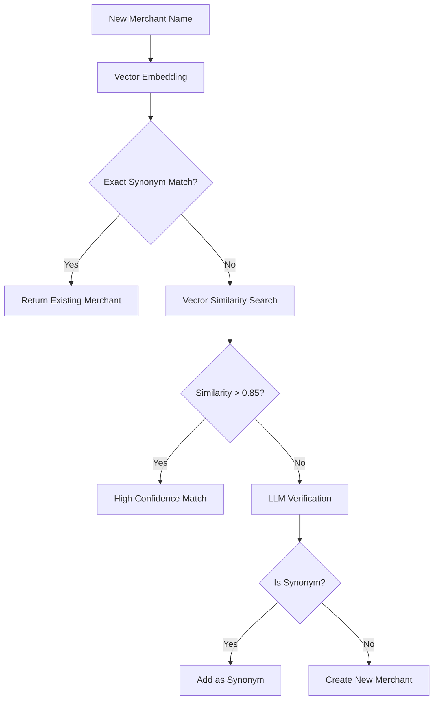

# PDF Invoice Processor with Merchant Classification

A Streamlit application that processes PDF invoices/receipts, automatically classifies merchants using vector similarity and LLM verification, and provides natural language querying capabilities.

## Features

- PDF text extraction
- Automatic merchant classification
- Invoice/receipt metadata extraction
- Natural language querying
- Vector similarity search
- Multi-language support

## Technical Architecture

### Components

1. **MultilingualMerchantClassifier**
   - Uses SentenceTransformer for vector embeddings
   - MongoDB Atlas Vector Search for similarity matching
   - Claude for merchant verification and synonym detection

2. **PDF Processor**
   - PyMuPDF for text extraction
   - Claude for metadata extraction
   - Structured data parsing

3. **Query Interface**
   - Natural language to MongoDB query conversion
   - Cross-collection aggregation support
   - Real-time result display

## Setup Instructions

### 1. Environment Setup

```bash
# Create virtual environment
python -m venv .venv

# Activate environment
source .venv/bin/activate  # Unix/MacOS
.venv\Scripts\activate    # Windows

# Install dependencies
pip install -r requirements.txt
```

### 2. MongoDB Atlas Configuration

1. Create a MongoDB Atlas cluster
2. Enable Vector Search
3. Create the following indexes:
   ```javascript
   // Merchants collection
   db.merchants.createIndex({"canonical_name": 1}, {unique: true})
   db.merchants.createIndex({"synonyms": 1})

   // Documents collection
   db.documents.createIndex({"merchant_id": 1})
   db.documents.createIndex({"processed_date": 1})
   db.documents.createIndex({"merchant_name": 1})
   ```

### 3. Secrets Configuration

1. Rename `.streamlit/secrets_template.toml` to `.streamlit/secrets.toml`
2. Fill in your credentials:

```toml
# MongoDB Configuration
mongodb_uri = "mongodb+srv://<username>:<password>@<cluster>.mongodb.net/"
# Replace:
# - <username> with your MongoDB username
# - <password> with your MongoDB password
# - <cluster> with your cluster address
database_name = "your_database_name"

# Anthropic API Configuration
anthropic_api_key = "your_anthropic_api_key"
# Get your API key from: https://console.anthropic.com/account/keys
```

## Merchant Classification Algorithm

The merchant classification process follows these steps:

1. **Vector Embedding**
   - Convert merchant name to vector using SentenceTransformer
   - Model: "paraphrase-multilingual-mpnet-base-v2"
   - Supports multiple languages including Chinese

2. **Similarity Search**


3. **LLM Verification**
   - Uses Claude to verify potential matches
   - Considers:
     - Common variations
     - Misspellings
     - Business name patterns
     - Multi-language equivalents

4. **Merchant Storage**
   ```javascript
   {
     canonical_name: "Merchant Name",
     synonyms: ["Variation 1", "Variation 2"],
     merchant_embedding: [...],  // 768-dimensional vector
     metadata: {
       first_seen: ISODate("..."),
       last_updated: ISODate("..."),
       source: "pdf_extraction",
       languages: ["en", "zh"]
     }
   }
   ```

## Usage Workflow

1. **Document Upload**
   - Upload PDF invoice/receipt
   - System extracts text and metadata
   - Classifies merchant automatically

2. **Merchant Classification**
   - Automatic detection of new/existing merchants
   - Synonym management
   - Multi-language support

3. **Data Storage**
   - Merchant data stored in merchants collection
   - Document data stored in documents collection
   - Cross-referenced using merchant_id

4. **Querying**
   - Use natural language queries
   - Examples:
     - "Show me all Grab receipts from last month"
     - "Calculate total spending by merchant"
     - "Find all transactions over $100"